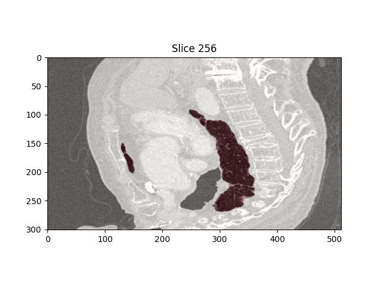
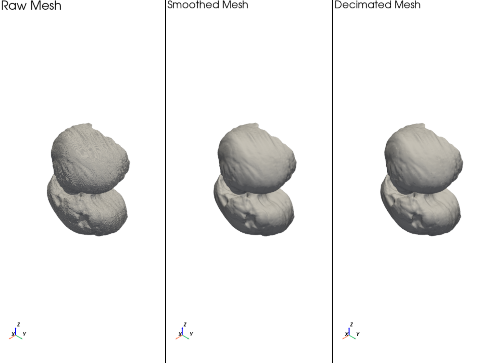
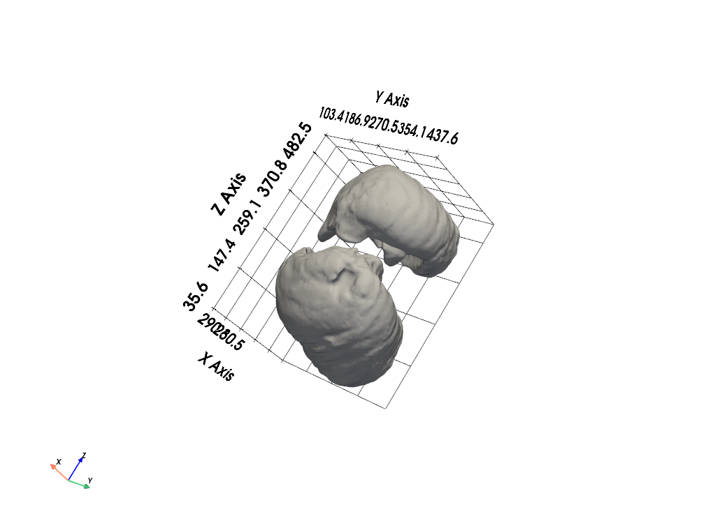
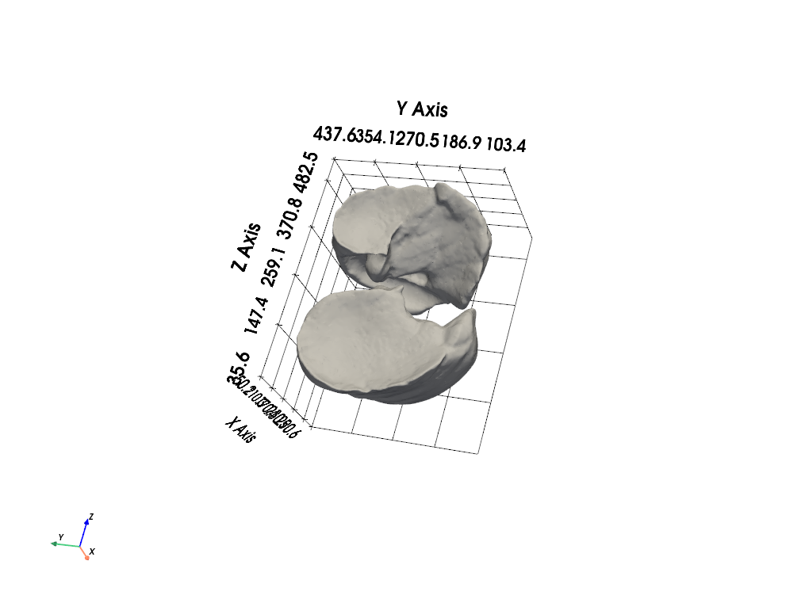

# Medical CT → 3D Mesh Reconstruction
This project converts medical CT data (NIfTI format) into a 3D surface mesh (.STL).  
It performs preprocessing, mesh extraction using Marching Cubes, smoothing, decimation, and provides 3D visualization.
이 프로젝트는 의료 영상 CT 데이터(NIfTI 형식)를 입력받아 3D 표면 메쉬(STL)를 자동으로 생성합니다.
세그멘테이션 마스크를 활용해 Marching Cubes 메쉬 추출 → 스무딩 → 디시메이션 → 3D 시각화까지 한 번에 수행할 수 있습니다.

### CT Slice with Segmentation


### Raw/Smoothed/Decimated Mesh


### 3D Viewer Result



---

## Sample Data (Kaggle)
이 프로젝트는 예시 CT 데이터로 아래 Kaggle 공개 데이터셋을 사용했습니다:
“Finding Lungs in CT Data”
Kaggle Dataset: https://www.kaggle.com/datasets/kmader/finding-lungs-in-ct-data

---

## 📌 Features
- Load CT volume & segmentation mask (nii)
- Apply CT windowing & mask preprocessing
- Display CT slice preview with segmentation overlay
- Generate 3D mesh using **Marching Cubes**
- Improve geometry using **Laplacian smoothing**
- Reduce polygon count using **mesh decimation** 
- Visualize the final mesh in an **interactive 3D viewer**

---

## 📂 Project Structure
```
medical_mesh_project/
│
├── data/
│ ├── IMG_0059.nii
│ └── MASK_0059.nii
│
├── output/
│ ├── mesh_raw.stl
│ ├── mesh_smooth.stl
│ └── mesh_decimated.stl
│
└── src/
  ├── main.py
  ├── loader.py
  ├── preprocess.py
  ├── mesh_gen.py
  └── visualize.py
```


---

## ⚙️ Installation
### 1. Create virtual environment(optional)
### 2. Install dependencies
pip install -r requirements.txt

---

## 🛵Run
python main.py
Output meshes (.stl) will be generated in the output/ folder.

The program will:
1) Load CT & mask
2) Preprocess mask
3) Show middle CT slice
4) Extract raw mesh
5) Smooth the mesh
6) Decimate (reduce polygons)
7) Open interactive 3D viewer